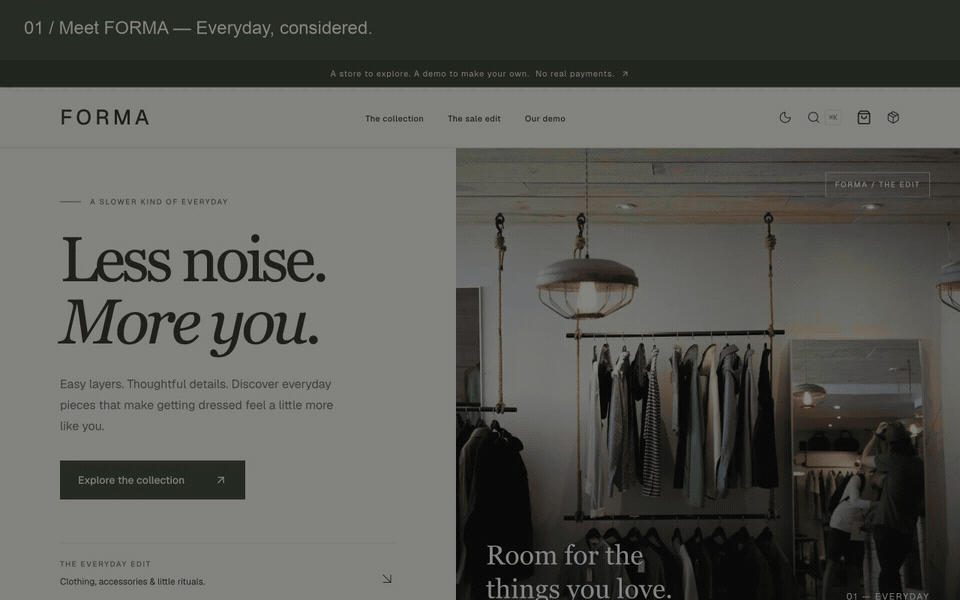
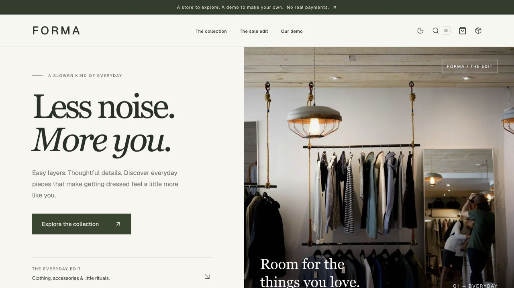
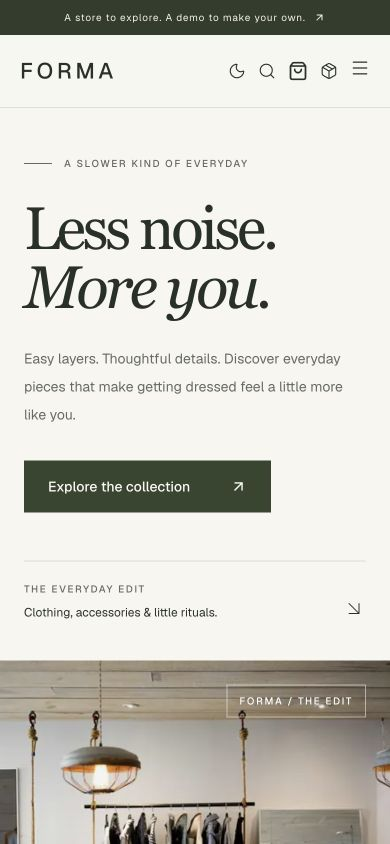
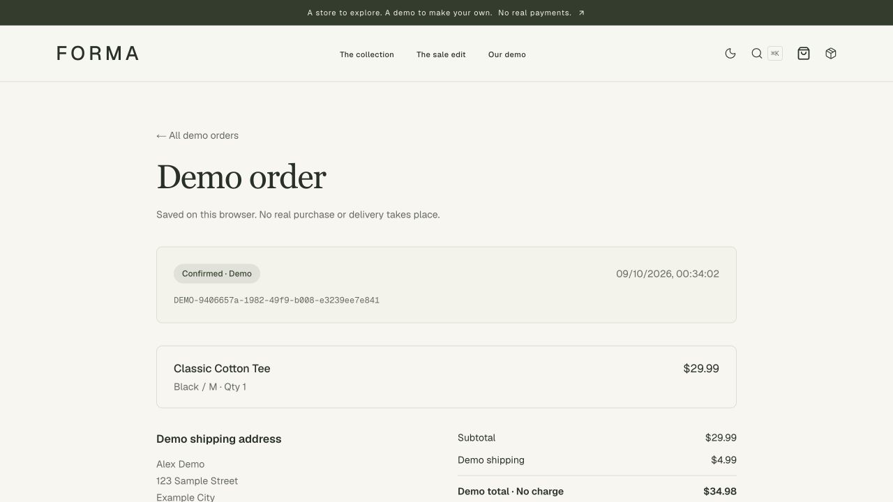

# FORMA — Next.js Ecommerce Template

[](LICENSE)
[](https://github.com/SakuraUltra/forma-commerce/actions/workflows/storefront-checks.yml)

**A boutique ecommerce storefront, from first browse to saved demo order.**

FORMA is the sample brand inside **forma-commerce**: a portfolio project and reusable **Next.js, React and TypeScript** template. Warm ivory, deep olive and an editorial layout frame a complete guest shopping journey—no API keys or database setup required.

[Run locally](#quick-start) · [Project case study](docs/showcase.md) · [v0.1.0 release](https://github.com/SakuraUltra/forma-commerce/releases/tag/v0.1.0) · [中文说明](docs/README.zh-CN.md)

> This is a **demo storefront**. It does not accept payments, register accounts, send emails or ship products. Cart and order data live in the visitor's browser. Use the fictional address provided at checkout.

## Preview

[](https://github.com/SakuraUltra/forma-commerce/releases/tag/v0.1.0)

[Watch the MP4 walkthrough](docs/media/storefront-walkthrough.mp4) · [Explore the design and engineering decisions](docs/showcase.md)

The GIF and video are montages of captured screens from the working interface, not real-time screen recordings. Run the project locally to try the interactions.

[Download the offline showcase kit](https://github.com/SakuraUltra/forma-commerce/releases/download/v0.1.0/forma-v0.1.0-showcase.zip): extract the ZIP and open `index.html` for a static presentation with images and video. Interactive shopping requires [running the project locally](#quick-start).

<details>
<summary>View desktop, mobile and order screenshots</summary>



| Mobile storefront                                                                  | Saved demo order                                                                                                |
| ---------------------------------------------------------------------------------- | --------------------------------------------------------------------------------------------------------------- |
|  |  |

</details>

## Quick start

Use Node.js **22.22+** (Node 22 LTS recommended).

```bash
git clone --branch v0.1.0 https://github.com/SakuraUltra/forma-commerce.git
cd forma-commerce
npm ci
npm run dev
```

This checks out the **v0.1.0** release. Omit `--branch v0.1.0` to work with the latest `main` branch.

Open [localhost:3000](http://localhost:3000). No `.env`, database, seed command, payment key or account is required. Internet access is needed for dependency installation, Google fonts at build time and remote product photographs.

## Try the complete journey

1. Open **The collection**, filter by category/colour/price, or search with **⌘K / Ctrl+K**.
2. Choose a product colour and size. Unavailable variants cannot be added.
3. Open the cart, adjust quantities and continue to checkout.
4. Keep the example shipping address and select **Place demo order**. There is no card form.
5. View the saved order, refresh the page, then open **Explore demo delivery**.
6. Advance the simulated delivery steps. The orders page keeps your history and lets you clear it.

## Features

- **One catalog, everywhere:** home, search, filtered listings, sale items, all 12 product pages and sitemap share one data source.
- **Shareable discovery:** category, colour, price and sorting are reflected in the URL; direct links such as `/products?sort=newest` preserve the **Newest** sort order.
- **Persistent cart:** variant quantities survive reloads; integer validation, unavailable-product handling and per-variant stock limits.
- **Guest checkout:** catalog-based price recalculation, consistent shipping thresholds, empty-cart protection and useful storage-error feedback.
- **Saved demo orders:** unique IDs, item and price snapshots, order history, missing-order states and interactive simulated delivery.
- **Boutique visual identity:** an editorial home page, warm neutral surfaces, olive accents and a responsive layout with dark/light themes.
- **Accessible interactions:** labelled controls, keyboard search, a skip link, mobile navigation and filters.
- **Configurable branding:** store name, description, currency, shipping and canonical URL in one file.
- **Validation:** domain and component tests plus lint, TypeScript and production build checks; GitHub Actions configuration lives alongside the code.

## Make it your own

| Change                                                               | File                                        |
| -------------------------------------------------------------------- | ------------------------------------------- |
| Store name, currency, locale, shipping threshold and repository link | `src/lib/store-config.ts`                   |
| Products, images, categories, colours, prices and sample stock       | `src/lib/catalog.ts`                        |
| Home page copy and sections                                          | `src/components/home/`                      |
| Theme and visual tokens                                              | `src/app/globals.css`                       |
| Allowed external image hosts                                         | `next.config.ts`                            |
| Public canonical URL                                                 | `NEXT_PUBLIC_SITE_URL` (see `.env.example`) |

All monetary values are **integer cents**. The initial catalog is priced in USD. Changing `currency` changes presentation, **not exchange rates**; update catalog prices, price-filter thresholds and shipping amounts for a different market. Product photos illustrate the sample catalog and do not change when selecting a colour.

## Development

```bash
npm run lint
npm run test:run
npm run build
npm run start
```

`npm run test` starts watch mode. `npm run typecheck` performs a separate type check (the production build also checks types). The [Storefront checks workflow](.github/workflows/storefront-checks.yml) installs locked dependencies, lints, tests and builds on pull requests and pushes to `main`. It can also be run manually from GitHub Actions. It uses a read-only repository token and does not deploy the site. Check the [Actions page](https://github.com/SakuraUltra/forma-commerce/actions/workflows/storefront-checks.yml) for the status of a particular commit.

Tests cover stock and quantity limits, duplicate and stale cart data, price recalculation, shipping boundaries, unique order IDs, persistence, malformed saved orders, failed storage, missing orders and the guest checkout UI.

## Architecture and boundaries

Next.js App Router · React · TypeScript · Tailwind CSS · Base UI · Zustand · Vitest

```text
Shared catalog → browsing / search / product detail
                          ↓
                persistent variant cart
                          ↓
           validate catalog prices and quantities
                          ↓
         order snapshot saved to browser storage
                          ↓
              order history / demo delivery
```

This is a frontend commerce demo, not a production transaction system. Browser storage can be edited or cleared and is not an authentication or security boundary. Inventory limits apply per cart; placing orders does not reserve shared stock. Shipping is simulated and taxes are not calculated.

`prisma/schema.prisma` preserves the original relational design **as a reference only**. Prisma, Stripe and authentication are not connected to the app. The unused SDK wrappers and outdated database seed were removed from the default installation; adding production commerce requires server-side ownership and validation. See the [extension guide](docs/architecture.md).

## Optional deployment

The project can be explored through this README, the release assets and a local installation. To host your own copy, run `npm run build` and deploy to a host supporting Next.js. Set `NEXT_PUBLIC_SITE_URL` to the actual public address before the production build. Full instructions and post-deployment checks are in [docs/deployment.md](docs/deployment.md).

## Images and licensing

Sample imagery is served from Unsplash; photographs are not included under the application's code license. Updated images: [candle by Jack Baxter](https://unsplash.com/photos/a-lit-candle-in-a-glass-jar-on-a-table-fCe0oFccURY), [tote by Rahul Bhogal](https://unsplash.com/photos/white-tote-bag-lihCTIOP28U), and [watch by Lucas Kepner](https://unsplash.com/photos/a-watch-sitting-on-top-of-a-black-table-KqmdTLEji08). Replace imagery and branding before presenting the template as your own commercial store.

Application code is available under the [MIT License](LICENSE).
